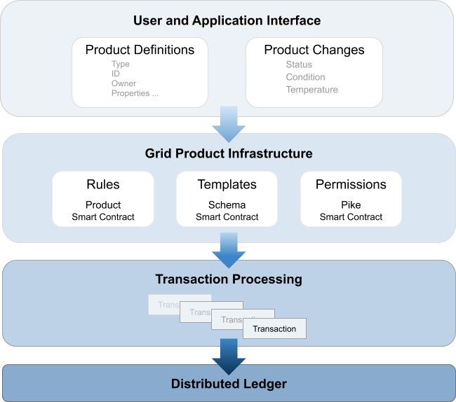

# Grid Product

<!--
  Copyright 2018-2021 Cargill Incorporated
  Licensed under Creative Commons Attribution 4.0 International License
  https://creativecommons.org/licenses/by/4.0/
-->

Grid Product provides a way to share standardized product data for items that
are transacted, traded, or referenced in a supply chain. Grid Product is
grounded in [GS1 standards](https://www.gs1.org/standards) for trade items, but
features a flexible design that can be extended to other standards.

With Grid Product, it's easy to define and share product-related data.

Hyperledger Grid's modular architecture allows Grid Product to cleanly separate
the product-related business rules from the creation and management of product
data. The Grid Product smart contract defines the product operations (create,
update, and delete). Other Grid utilities let users and applications define,
manage, and query trade item data with command-line tools, YAML files, and
web-based requests to REST API endpoints. As a result, product management is
easily handled without additional application development or smart contract
creation.

Grid Product can interact seamlessly with other smart contracts to manage owner
and agent permissions, product property templates (also called schemas),
location data, and more.

These components combine to submit transactions to the back-end distributed
ledger, securely and efficiently sharing product data with all trading partners.

By default, Grid Product supports the GDSN 3.1 trade item schema for product
definitions. This allows users who already have product data conforming to this
standard to easily submit their product definitions into Grid.

To support this functionality, the Grid Product CLI provides functionality to
parse and validate XML data against the [GridTradeItems XML Schema Definition](https://github.com/hyperledger/grid/blob/main/sdk/src/products/gdsn/GridTradeItems.xsd).
The gridTradeItems element defined within the GridTradeItems XSD acts as a
wrapper for tradeItems elements as defined in the GDSN
[TradeItem XSD](http://www.gdsregistry.org/3.1/schemas/gs1/gdsn/TradeItem.xsd).
Note that with this pattern, GDSN data is validated in the client, rather than
in the smart contract.

GDSN trade item standards were chosen as the default for Grid due to wide
adoption of this format and the availability robust XML schemas available.
However, if GDSN standards are not desirable for a use case, users can easily
define schemas to support other standards as well.
